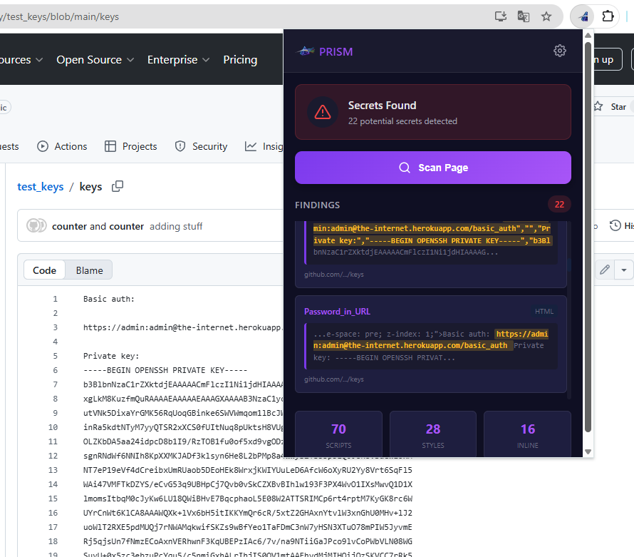
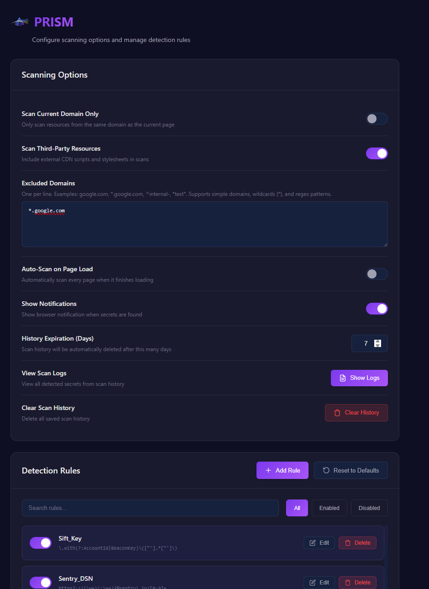
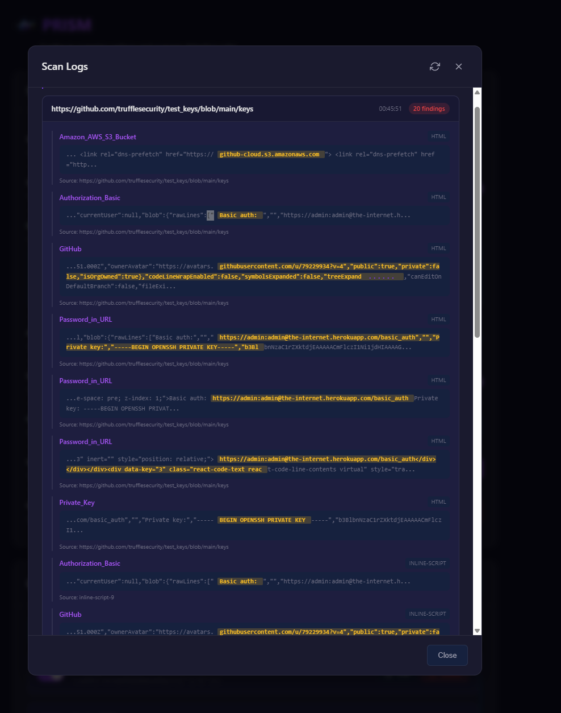

# Prism: Browser-Based Secret Scanner

Prism is a lightweight browser extension designed for security engineers and bug bounty hunters. It performs passive scanning on web pages to detect exposed secrets (API keys, tokens, credentials) and sensitive information in the client-side code.

With customizable regex rules and domain exclusions, Prism acts as a transparent optical filter, revealing hidden threats in the source code as you browse.

## ✨ Key Features

*   **🔍 Passive Scanning:** Automatically scans HTML content, inline scripts, and externally loaded JavaScript/CSS files.
*   **⚡ Real-Time Alerts:**
    *   **Popup Badge:** Shows the number of findings immediately on the extension icon.
    *   **In-Page Notification:** Displays a discreet "PRISM Alert" overlay on the page when high-severity secrets are found.
*   **🛡️ Customizable Rules:**
    *   Comes with 60+ built-in regex patterns (AWS, Google, Stripe, Slack, etc.).
    *   Add, edit, or disable rules via the Options page.
*   **📜 History & Logs:**
    *   Keeps a local history of scanned pages and findings.
    *   "View Scan Logs" feature to review past detections.
    *   Auto-expiration setting to keep history clean (default: 7 days).
*   **🔒 Privacy First:** All scanning happens locally in your browser. No data is sent to any external server.

## 📸 Screenshots

| Popup Interface | Options & Rules | Scan Logs |
|:---:|:---:|:---:|
|  |  |  |

## 🚀 Installation (Manual)

PRISM is currently available for manual installation (sideloading).

### Chrome / Chromium (Brave, Edge, Opera)

1.  **Download:** Clone this repository or download the ZIP file and extract it.
2.  **Open Extensions:** Navigate to `chrome://extensions` in your address bar.
3.  **Developer Mode:** Enable the **"Developer mode"** toggle in the top-right corner.
4.  **Load Extension:**
    *   Click **"Load unpacked"**.
    *   Select the root folder of the project (`SecretScanner` folder containing `manifest.json`).
5.  **Verify:** The PRISM icon should appear in your toolbar.

### Firefox

1.  **Download:** Clone this repository or download the ZIP file.
2.  **Open Debugging:** Navigate to `about:debugging#/runtime/this-firefox`.
3.  **Load Add-on:**
    *   Click **"Load Temporary Add-on..."**.
    *   Navigate to the `firefox/` folder in the project.
    *   Select the `manifest.json` file.
4.  **Note:** Temporary add-ons are removed when you restart Firefox.

## 📖 Usage

1.  **Browse Normally:** Visit any website. PRISM scans in the background.
2.  **Watch for Alerts:**
    *   If a secret is found, the **extension icon** will show a red badge count.
    *   A **"PRISM Alert"** notification will appear in the top-right corner of the page.
3.  **View Details:**
    *   Click the extension icon to see a summary of findings.
    *   Click on a finding to see the specific secret and context.
4.  **Manage Settings:**
    *   Right-click the icon and choose **Options** to configure rules, ignored domains, and history settings.

## ⚙️ Configuration

Access the **Options** page to customize:

*   **Scan Scope:** Limit scanning to current domain only or include 3rd party resources.
*   **Notifications:** Toggle browser notifications and in-page alerts.
*   **Exclusions:** Add domains to the "Excluded Domains" list (supports wildcards like `*.google.com`).
*   **History:** Set retention period (days) or clear history manually.

## 🤝 Contributing

Contributions are welcome! Please feel free to submit a Pull Request to share new regex rules or features.

## 📄 License

This project is licensed under the GPL v3 License - see LICENSE file for details.

---
**Disclaimer:** This tool is intended for security research and educational purposes. Always ensure you have proper authorization before scanning websites you don't own.
